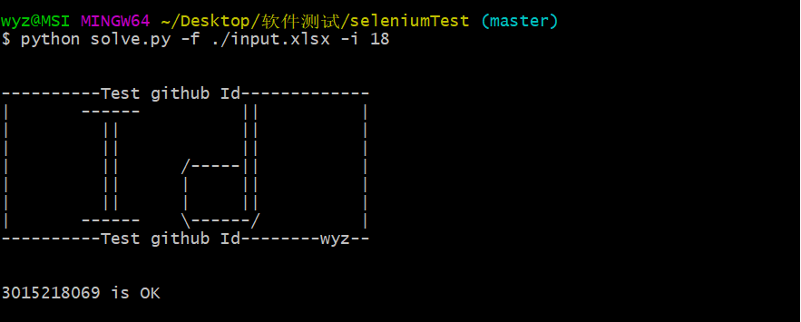
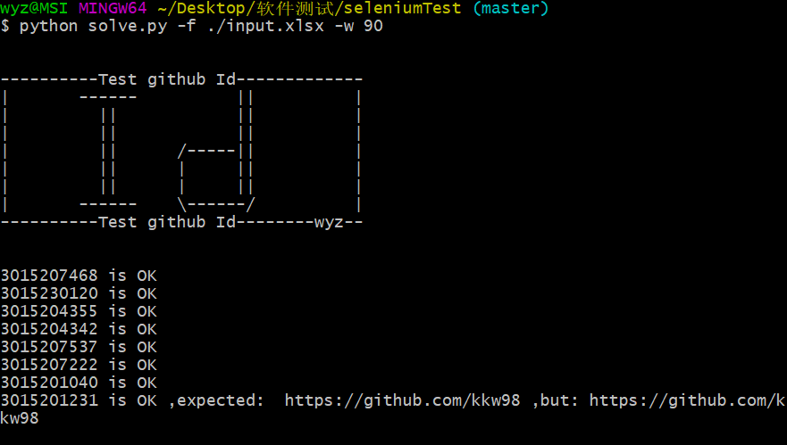

# seleniumTest

> SeleniumTest is a tool for TJU software students to test if their ID is recoded on github.Base on selenium,headless chrome driver

``` powerShell
Useage:

-f, Specify absolute or relative filepath.
	
-u, Specify url. default url is https://psych.liebes.top/st. 
	
-i, Specify single data.
	
-w, Specify data from which row,default 1st.
```

## Deal with Data

1. Some data are with `/` at the end,but some has not
2. Some data are with `space` at the begining,but some has not
3. One data are with `www`.

## Option example

### -i



### -w



## Q&A

`Q: Why can't I run this py?`
`A: U need install selenium and ChromeDriver first.Use pip plz`
